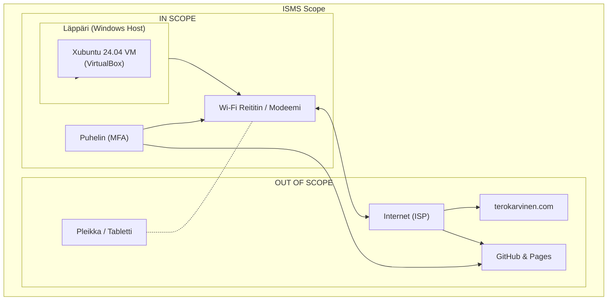
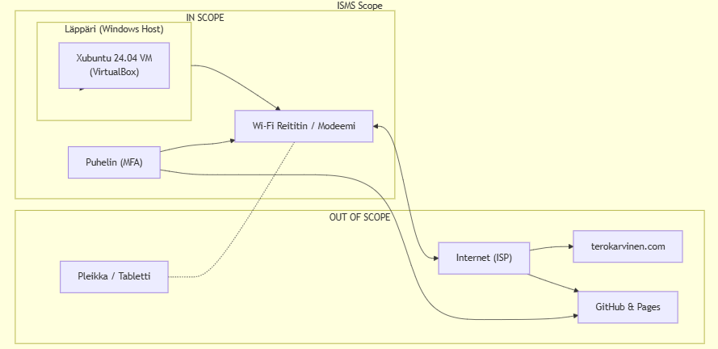

# h1 Freedom of Action, Control, and Risk Mitigation

## A) Rajaus ja ympäristön kuvaus

### A1) In-Scope
* **Laitteet:**
  * Pääkoneena toimiva läppäri (Windows-käyttöjärjestelmä).
  * VirtualBoxissa pyörivä Xubuntu 24.04 -virtuaalikone("Kouluntu"), jota käytän kurssitehtävissä ja testailussa.
  * Kotiverkon Wi-Fi-reititin / modeemi (toimii reittinä ulkomaailmaan).
  * Oma kännykkä, jota tarvitsen kaksivaiheiseen tunnistautumiseen (2FA/MFA) githubissa.
* **Tiedot ja materiaalit:**
  * Kurssimateriaalit ja tehtävänannot (`terokarvinen.com`-sivustolta).
  * Omat koodit, Git-repositorio ja tehtäväraportit.

### A2) Out-of-Scope
* **Laitteet:** Pleikka sekä tabletti, muita älylaitteita ei ole.
* **Verkko ja ulkoiset palvelut:** Internet-palveluntarjoajan (ISP) runkoverkko, ulkopuoliset nettisivut ja koulun muut verkkojärjestelmät.
* **Perustelu:** Näillä laitteilla ei ole mitään tekemistä sovellustestauksen tai kurssitehtävien kanssa. Rajaus pitää homman selkeänä.

### A3) Tärkeimmät rajapinnat ja rajat
* **Tunnistautumisen raja:** GitHubin 2FA-varmennus kännykän kautta.
* **Verkkoraja:** Kotiverkon ja julkisen internetin välinen raja (reititin ja sen NAT/palomuuri).
* **Ulkoiset palvelut:** GitHub & GitHub Pages (koodin hallintaan ja raporttien julkaisuun) sekä `terokarvinen.com` (tehtävämateriaalien/tehtävänannon hakemiseen).

---

### Network & Interface Diagram

---
Github Pagesiin kuva:

---
### Todisteet (Evidence Addendum / What evidence could I present?)

* **Virtuaalikoneympäristö:**
  Voisin esittää ruudunkaappauksen VirtualBoxin päänäkymästä (VM-listaus). Se todistaa, että oppimistehtäviä varten on luotu erillinen "Kouluntu"-virtuaalikone (Xubuntu 24.04).

* **Tunnistautuminen ja tilinturvallisuus:**
  Voisin näyttää ruudunkaappauksen GitHubin turvallisuusasetuksista (Security Settings), joka osoittaa kaksivaiheisen tunnistautumisen (2FA/MFA) olevan aktivoituna ja kytkettynä matkapuhelimeeni.

* **Tehtävämateriaalien ja koodin hallinta:**
  Voisin antaa linkin julkiseen GitHub-repositoriooni ja sitä vastaavaan GitHub Pages -sivustoon, josta näkyvät versionhallinnan historia (Git-commitit), lähdekoodit sekä julkaistut tehtäväraportit.

## B) Tehtävän kytkeminen ISO 27001 -standardiin

| Sidosryhmä (*Interested Party*) | Tarve tai vaatimus (*Need or Requirement*) | ISO 27001 -alue | Miten täyttyminen osoitetaan (*Evidence*) |
| :--- | :--- | :--- | :--- |
| **Opiskelija (Minä itse)** | Hommien jatkuvuus: opiskeluympäristö pysyy pystyssä, tehtävät ei häviä ja koodit säilyy tallessa. | **Operation** (Toiminta) & **Planning** (Suunnittelu) | Tehtävien palautukset GitHubiin ja toimiva snapshot virtuaalikoneesta ennen kokeiluja. |
| **Kurssin opettaja / Koulu** | Varmuus siitä, että pysytään rajoissa: harjoitukset tehdään turvallisesti eikä testiympäristöstä hyökätä luvatta minnekään. | **Leadership** (Johtajuus) & **Performance Evaluation** (Suorituskyvyn arviointi) | Kirjallinen rajauskuvaus (scope), selkeä verkkokaavio sekä GitHub Pagesissa julkaistut tehtäväraportit. |

## Tekoälyn käyttöilmoitus (AI Disclaimer)
Raportin rakenteen, suomennosten, Mermaid-verkkokaavion sekä ISO 27001 -taulukon hahmottelussa on käytetty apuna Gemini Flash 3.6 -tekoälymallia.