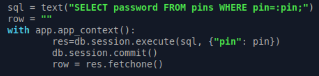
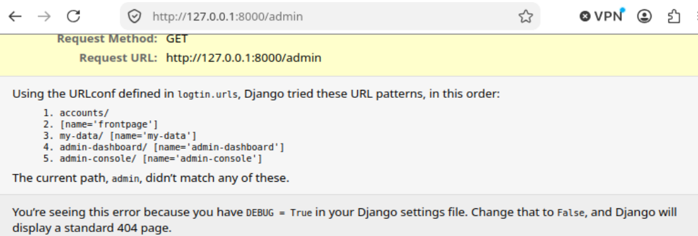
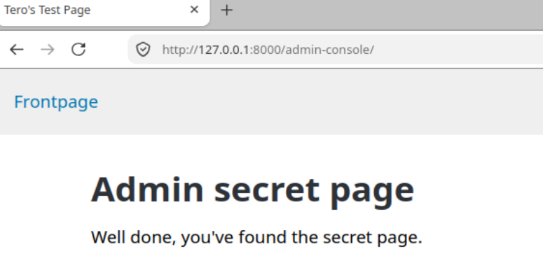
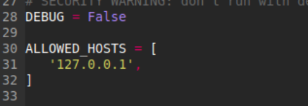
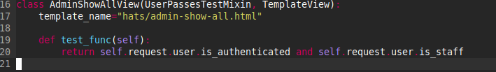

# h02 Break & Unbreak

### x)

* **OWASP: A01 Broken Access Control**
    * Verkkosovelluksien yleisin riski, jossa käyttäjä voi toimia roolinsa tai oikeuksiensa ulkopuolella.
    * Edellyttää tiukkaa palvelinpuolen oikeuksien tarkistusta ja periaatetta "oletuksena kielletty".

* **Karvinen: Find Hidden Web Directories - Fuzz URLs with ffuf**
    * Osoittaa, miten verkkosivuilta etsitään piilotettuja kansioita ja tiedostoja automaattisesti `ffuf`-työkalulla sanalistan avulla.

* **PortSwigger: Access control vulnerabilities and privilege escalation**
    * Käsittelee käyttöoikeuksien puutteita ja valtuuksien eskalointia (pysty- ja vaakasuuntaiset oikeuksien vuodot).

* **Karvinen: Report Writing**
    * Ohjeistus hyvään ja toistettavaan tietoturvaraportointiin: kerrotaan selkeästi mitä tehtiin, mitä havaittiin ja miten tilanne korjataan.

* **PortSwigger: What is SQL injection? (Valinnainen)**
    * Esittelee periaatteen siitä, kuinka puutteellisen syötteenkäsittelyn vuoksi sovelluksen tietokantakyselyitä voidaan manipuloida syötteiden kautta.

---

## a)
Pienen alku säädön ja selaimen lataamisen (firefox) Xubuntuun olin valmis aloittelemaan. Ohjeiden mukainen alustus.
Sitten lähdin kokeilemaan syöttämällä input-kenttään ihan perus ``' OR 1=1 -- `` mutta se ei toiminut ja paljastui että input pitää olla numero. Hieman kokeiltua tajusin mennä f12 dev toolsien kimppuun. siellä vaihdoin lomakkeen (form) inputin ``type="number"`` -> ``type="text"``
sen jälkeen kokeilin uudestaan tuota mutta edelleen vaati numeroita. sitten vaihdoin suoraan inputin value:n html:ään erillisiin testauksiin `' OR password LIKE '%SUPERADMIN%'` ja tämä johtikin jo että pääsin Internal server erroriin. Sitten hieman pyöriteltyä muistin vielä nuo viivat laittaa perään eli syötteenä ``' OR password LIKE '%SUPERADMIN% -- '`` sillä sain flagin.

flag  SUPERADMIN%%rootALL-FLAG{Tero-e45f8764675e4463db969473b6d0fcdd}

---

## b) Korjaus

Sen sijaan että syöte liitetään suoraan osaksi SQL-merkkijonoa, käytetään **parametrisoituja kyselyjä**.

* **Muutos koodissa:** SQL-kyselyyn vaihdettiin muuttujan paikalle nimetty parametri (`:pin`) merkkijonojen yhteenlaskun sijaan.
* **Turvallisuus:** Käyttäjän syöte välitetään tietokannalle erillisenä sanakirjana `{"pin": pin}`, jolloin tietokanta käsittelee sen aina puhtaana datana. Vaikka syötteessä olisi SQL-komentoja tai heittomerkkejä, ne eivät voi enää rikkoa tai manipuloida itse kyselyn rakennetta.

Kokeilin aikaisempaa ratkaisua eikä tullut flag enää näkyviin taikka internal server erroria.

## d)
Lähdin taas ohjeiden mukaisesti asentamaan paketit yms.
Huvikseni testasin admin kirjautumista klassisilla admin admin, root root ja user password. Ei onnistanut. Sitten loin käyttäjän ja testasin että pääsen my data sivulle ja admin dashboard antaa 403 errorin.
Kokeilin lisätä osoitteen perään /admin ja sillä sainkin kaikki sivustot listattuna Ilmeisesti mikä tahansa väärä sana antaa saman. Kuvassa näkyy:
 

kirjautuneena pääsikin heti sisään tuohon /admin-console sivun sisään. 

## e)
Oletin että selain osasi mainita jo tuon osoitteen näkymisen korjauksenkin. ``You’re seeing this error because you have DEBUG = True in your Django settings file. Change that to False, and Django will display a standard 404 page`` (aiemmassa kuvassa) ja niinhän se olikin. Ratkaisuna siis muuttaa "Django settings file" (eli logtin/settings.py) DEBUG = False ja lisätä sitten ALLOWED_HOSTS = ['127.0.0.1',]

Tämän jälkeen error page ei paljasta salaisuuksia. Mutta vielä kuka vaan kirjautunut voi päästä admin-console sivulle(Broken Access Control). Tämä on nopeasti korjattu. /logtin/hats/views.py scriptiin pitää vain lisätä riville 20 "and self.request.user.is_staff" jonka jälkeen perus käyttäjä ei pääse admin-console näkymään.

## Tekoälyn käyttö

Tehtävässä on käytetty apuna **Gemini 3.5 Flash-Lite** -tekoälymallia. Lähinnä tehtävään liittymättömien Xubuntu ongelmien ratkaisussa.