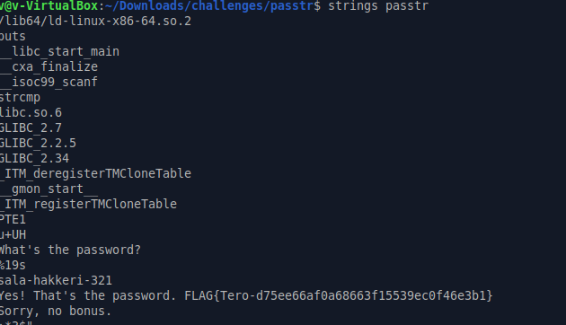
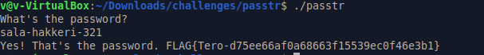

# h3 No Strings Attached
Tehtävät tehty Xubuntu 24.04 järjestelmällä.

Tämä olisi voinut olla kurssin eka tehtävä tai ainakin ennen ghidraa.

## a)
tehtävä oli melko suoraviivainen `strings passtr` komennolla paljastuu salasana `sala-hakkeri-321`sekä flag ` FLAG{Tero-d75ee66af0a68663f15539ec0f46e3b1}
strings tuloste
`


ja testaus



## b)
lähdin tekemään tunnilla käytyä obfuskointia eli siirrän jokaisen char -1 tämän nopeuttaakseni laitoin AI:n tekemään scripti korjaukset

koodi: 
```
// passtr - a simple static analysis warm up exercise
// Copyright 2024 Tero Karvinen https://TeroKarvinen.com

#include <stdio.h>
#include <string.h>

int main() {
	char password[20];
	
	printf("What's the password?\n");
	scanf("%19s", password);
	char encoded_pass[] = {114, 96, 107, 96, 44, 103, 96, 106, 106, 100, 113, 104, 44, 50, 49, 48, 0};
	    int correct = 1;
	    
	    if (strlen(password) != strlen("sala-hakkeri-321")) {
	        correct = 0;
	    } else {
	        for (int i = 0; password[i] != '\0'; i++) {
	            if ((password[i] - 1) != encoded_pass[i]) {
	                correct = 0;
	            }
	        }
	    }
	    
	    if (correct) {
	        printf("Yes! That's the password. FLAG{Tero-d75ee66af0a68663f15539ec0f46e3b1}\n");
	    } else {
	        printf("Sorry, no bonus.\n");
	    }
	    return 0;
}

```
ja tämän muutoksen jälkeen salasana ei löytynyt enää strings komennolla.

## c)
suoritin `strings packd` komennon ja siellä näkyi oletettavasti salasanan osa `piilos-An
` ja lippu (tai ainakin osa sitä). 
```
FLAG{Tero-0e3bed0a89d88

51da933c64fefad

```
Kokeilin salasanaa sovellukseen eikä se toiminut joten epäilys osittaisesta salasanasta taisi osua.

Salasanaa en löytänyt edes AI avustuksella mutta se veikkasi että flag on FLAG{Tero-0e3bed0a89d8851da933c64fefad} sitä tosin mahdoton varmentaa kun ei ole salasanaa joka paljastaisi oikean vastauksen.

## Tekoäly
Tehtävässä c) koitin Gemini Flash-Lite 3.5 avulla löytää salasanaa tuloksetta.
