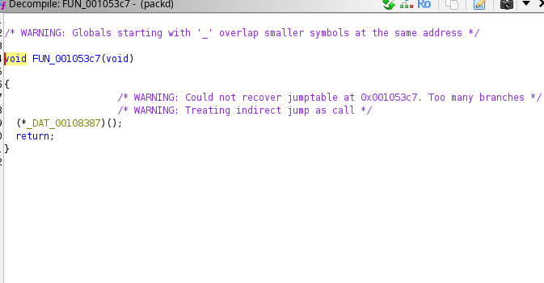
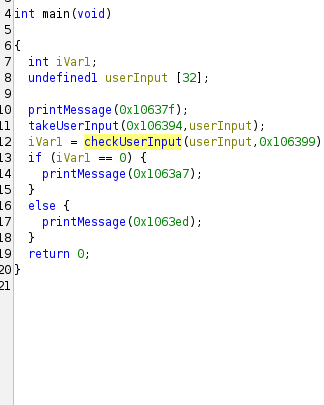
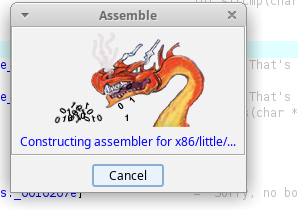
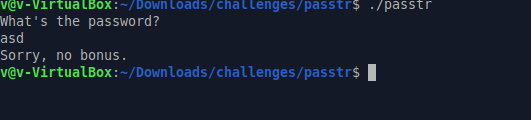
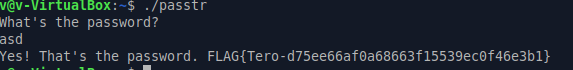
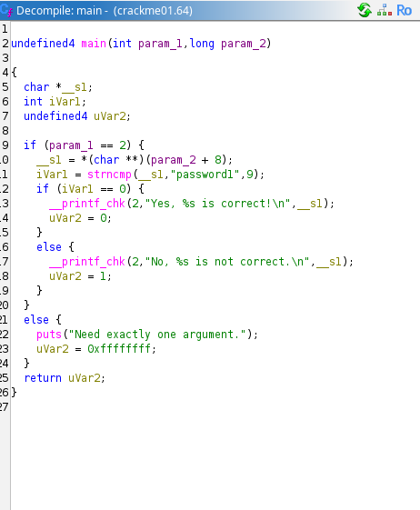
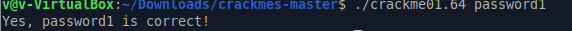
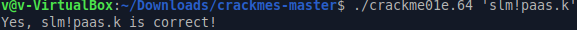
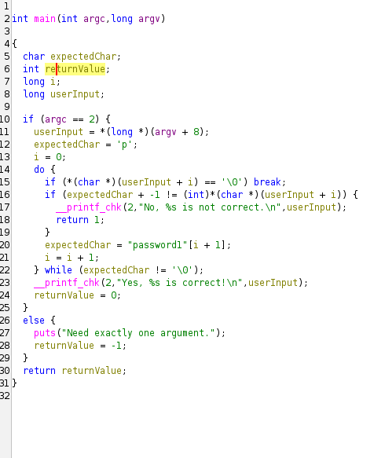

# h4

## Hammond (2022): Ghidra for Reverse Engineering (PicoCTF 2022 #42 'bbbloat')

* `file`-komento vahvistaa ohjelman 64-bittiseksi Linux ELF-binääriksi. Ohjelma pyytää suoritettaessa käyttäjältä suosikkinumeroa. Kevyttä analyysiä varten voidaan käyttää apuna työkaluja kuten `strace` ja `ltrace`.
*  Binääri tuodaan  **Ghidra**-työkaluun, joka dekompiloi konekielen helpommin luettavaksi C-koodiksi.
* Merkkijonojen haulla paikallistetaan kohta, jossa käyttäjältä kysytään lukua.
* Dekompiloidusta koodista havaitaan `if`-ehto, joka vertaa syötettä tiettyyn heksadesimaaliarvoon (`0x86187` eli desimaalina **549255**).
* Oikealla numerolla ohjelma kutsuu aliohjelmaa, joka purkaa tallennetut heksaluvut ja tulostaa PicoCTF-lipun.

* **Ratkaisu:** Syöttämällä luvun 549255 ohjelmalle saadaan lippu tulostettua onnistuneesti.

## b) packd
Aloitin avaamalla projektin ghidralla ja sitten lähdin tarkastelemaan funktioita. Heti alkuun huomasin että 5 ensimmäistä funktiota ei paljoa paljasta sillä ne ovat melko tyhjiä

Sitten löytyi oletettavasti main-funktio joka kutsuu muita funktioita
nopealla silmäilyllä ja arvauksen voimalla nimesin funktiot ja muuttujat 

## c) passtr
tämä olikin helpompi tehtävä koska tämä oli opetettu(sekä ghidra purki ohjelman paljon paremmin). minuutin tai pari odotettuani sain patch instructionin toimimaan

sitten vaihdoin vain JNZ -> JZ

testi ilman muutoksia

sitten testi uudelleen rakennetulla sovelluksella joka tulosti lipun FLAG{Tero-d75ee66af0a68663f15539ec0f46e3b1}

## d)Crackmes
Readme kertoi että makefile:n käyttö on se "oikea tie" näissä tehtävissä joten lähdin siitä liikkeelle.
## e) Nora crackme01
alkuun ``make crackme01`` ja sitten lähdetään liikkeelle avaamalla se ghidralla. Ghidra tunnisti heti main-funktion ja siellä näkyi password1 

jota lähdin kokeilemaan ja sehän toimi.

## e2? crackme01e
Taas makefile alkuun eli `make crackme01e` ja sitten ghidraan.
ghidra taas tunnisti main funktion ja sieltä löytyi suoraan ``slm!paas.k`` joka oli salasana

## f) Nora crackme02
Tässä tehtävässä oli tarkoitus nimetä main-funktion muuttujat ja tarkastella miten ohjelma toimii. Eli taas avataan sovellus ghidralla ``make crackme02`` kääntämisen jälkeen. Ghidra taas tunnisti main-funktion ja siinä näytti olevan aika perus do while loop joka vertailee kirjain kerrallaan käyttäjän syötteen. hieman nimeiltyä alkoi koodikin selventyä niin että siitä pystyi päätellä salasanan olevan password1 josta jokainen character on yhden taaempi (expectedChar + -1) eli salasana oli o`rrvnqc0

## Tekoäly ja ympäristö
Tehtävät tehtiin Xubuntu 24.04 järjestelmällä ja apuna ghidran käytössä toimi Gemini 3.5 flash lite -malli